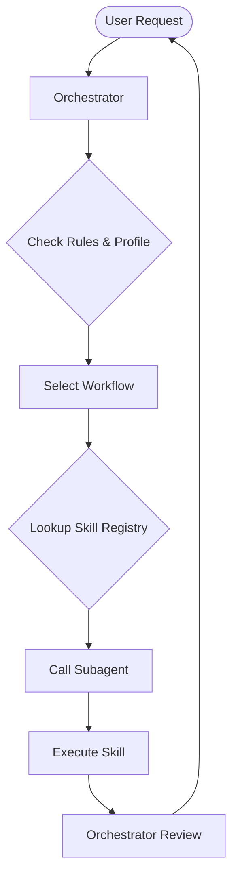

# Protocol: Agent Orchestration Logic

## Core Principle
Work is divided into **Orchestration** (Planning/Management) and **Execution** (Specialized Skills).

## 1. The Orchestrator (User-Facing Agent)
The primary agent that interacts with the user is the **Orchestrator**, as defined in [orchestrator-identity](file:///Users/eriksupit/Desktop/antigravity-template/.agent/rules/orchestrator-identity.md).
- **Role**: Understands user intent, chooses the right workflow, and manages the lifecycle of a task.
- **Rules Consultation**: Must strictly follow `.agent/rules/` and respect `user-profile.md`.
- **Delegation**: Does not perform specialized tasks directly if a Subagent exists for that purpose.

## 2. The Subagents (Specialists)
Found in `.agent/agents/`, these are agents defined by the `agent-template.md`.
- **Specialization**: Each Subagent is "married" to a specific `assigned_skill`.
- **Execution**: When called by the Orchestrator, the Subagent uses its skill to perform a specific part of the workflow.

## 3. Communication Pattern
1. **Request**: Orchestrator defines the task and passes relevant context (files, goals) to the Subagent.
2. **Action**: Subagent executes its `assigned_skill`.
3. **Response**: Subagent returns the output (e.g., refactored code, edited text) to the Orchestrator.
4. **Audit**: Orchestrator performs a final review of the Subagent's work before presenting it to the user.

## 4. Agent-to-Skill Registry (Absolute)
The Orchestrator MUST delegate based on this fixed registry. If a skill belongs to a Subagent, the Orchestrator is FORBIDDEN to execute it directly.

| Phase | Assigned Subagent | Primary Skill(s) | Role |
| :--- | :--- | :--- | :--- |
| **Discovery** | [interviewer.md](DOCS/agents/interviewer.md) | `brainstorming-pro`, `fact-search` | Gathering context. |
| **Architecting** | [architect.md](DOCS/agents/architect.md) | `architecture-visualizer` | Designing structure. |
| **Validation** | [auditor.md](DOCS/agents/auditor.md) | `context-audit`, `diff-analyzer` | Integrity check. |
| **Polishing** | [editor.md](DOCS/agents/editor.md) | `writing-style`, `linguistic-bridge` | Style & Final Message. |
| **Estimation** | [estimator.md](DOCS/agents/estimator.md) | `generate-quotation` | Quotation and cost calculation. |

## 5. Operational Loop

## 6. Contextual Restrictions (Token Conservation)
To ensure maximum token efficiency and maintain strict role boundaries:
- **Human-Only Documentation**: Orchestrator and all Subagents are **FORBIDDEN** from reading `README-ID.md` and `README-EN.md`. These are dedicated user guides.
- **Reference Protocol**: All operational instructions must be derived from `.agent/` only. Never use user-facing guides for system logic.
